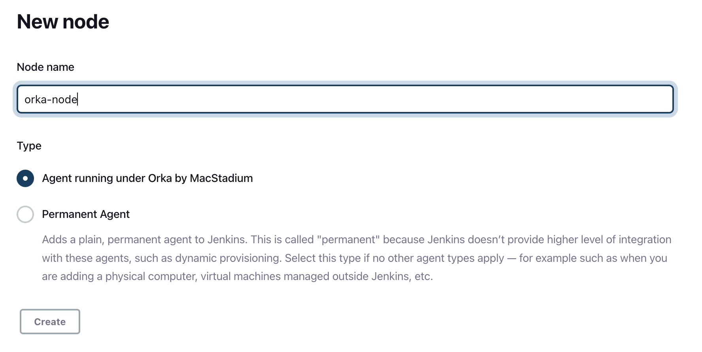
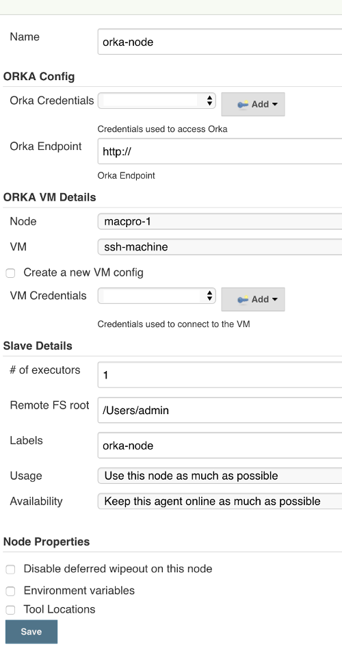
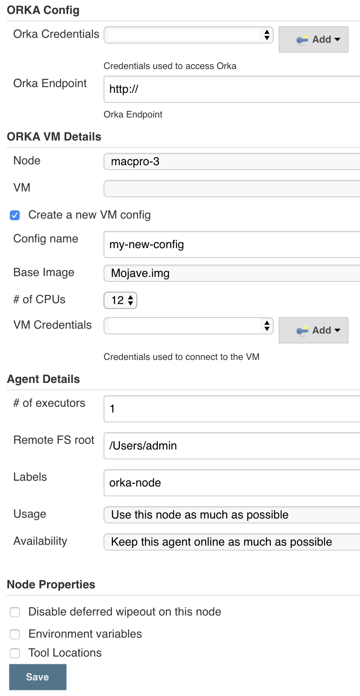
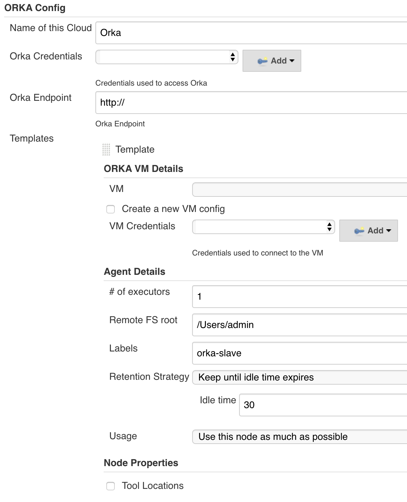
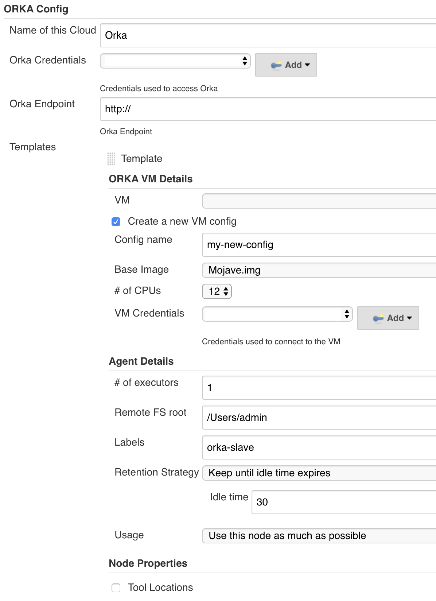

# Orka by MacStadium Jenkins Plugin

This is a Jenkins plugin to support both permanent and ephemeral Jenkins agents on [Orka by MacStadium][orka].

## Prerequisites

* [Orka by MacStadium][orka] environment - Used to deploy new VMs used as Jenkins agents.
* VPN connection to the Orka environment - Each Orka environment is behind a firewall. Your Jenkins master must have visibility to the environment.

## Permanent Agents

The plugin allows you to create permanent agents, running on [Orka by MacStadium][orka]. The plugin first deploys a new VM in an Orka environment and then uses SSH to connect to it.

### Usage

To create a permanent agent:
* Go to `Manage Jenkins` → `Manage Nodes and Clouds`  
**Note** If you are using a version earlier than Jenkins 2.205 go to `Manage Jenkins` → `Manage Nodes`
* Select `New Node`
* Provide a `Node name`
* Select `Agent running under Orka by MacStadium`
* Click `OK`

    

* Configure the agent you want to launch

    Provide values for the following Orka properties:

    * Orka Credentials - The credentials used to connect to the Orka environment. Created by running orka user create
    * Orka Endpoint - The endpoint used by the plugin to connect to the Orka environment
    * Node - The Orka node which the agent will be deployed on
    * Public Host (Optional) - Public node address as provided by the MacStadium team. Leave empty if you want to use the default node address. This addressed is used to connect to the Orka VM.  
    **Note** The public node addresses are provided by MacStadium.
    * VM (Optional) - The VM to be deployed. The field is inactive if `Create a new VM Config` is selected
    * Create a new VM config (Optional) - Tells the plugin to create a new VM config and deploy it as an agent
        * Config name (Optional) - The name of the new config. The field is inactive if `Create a new VM Config` is not selected
        * Base Image (Optional)  - The base image of the new config. The field is inactive if `Create a new VM Config` is not selected
        * \# of CPUs (Optional) - The number of CPUs of the new config. The field is inactive if `Create a new VM Config` is not selected
    * VM Credentials - The credentials used to SSH to the deployed VM
* Click Save

This is how a configuration with an existing VM looks like:

This is how a configuration with a new VM config looks like:

## Ephemeral Agents

The plugin allows Jenkins to create ephemeral agents, running on [Orka by MacStadium][orka]. The plugin first deploys a new VM in an Orka environment and then uses SSH to connect to it.   

A new agent is automatically created by Jenkins if the build load is too high and there are no available executors. Once the VM has been idle for a given amount of time, Jenkins terminates it automatically and all resources are cleaned up.

### Usage

To configure:
* Go to `Manage Jenkins` → `Manage Nodes and Clouds` → `Configure Clouds` → `Add a new cloud`  
**Note** If you are using a version earlier than Jenkins 2.205 go to `Manage Jenkins` → `Configure System` → `Add a new cloud`
* Select `Orka Cloud`
* Configure the cloud by providing values for:
    * Name of this Cloud - The name of the cloud
    * Orka Credentials - The credentials used to connect to the Orka environment. Created by running orka user create
    * Orka Endpoint - The endpoint used by the plugin to connect to the Orka environment
    * Click `Advanced` to configure also:
        * Max Jenkins Agents Limit - The maximum number of Orka VMs that can be created by that cloud instance. This allows you to better manage your Orka resources.
        * Deployment Timeout (sec) - The time after the request for new Orka VM will timeout. Defaults to 300 seconds (5 minutes).
    * Node Mappings (Optional) - Overwrite the default host address used to connect to an Orka VM. By default, the plugin uses the private node address. Provide a mapping to a public host address if you wish to change this behavior. This option is available by clicking `Advanced`
    **Note** The public node addresses are provided by MacStadium.
* Click Add Orka Template. An Orka template is the agent template, Jenkins will use to create a new agent.
* Fill the following values:
    * VM (Optional) - The VM to be deployed. The field is inactive if `Create a new VM Config` is selected
    * Create a new VM config (Optional) - Tells the plugin to create a new VM config and deploy it as an agent
        * Config name (Optional) - The name of the new config. The field is inactive if `Create a new VM Config` is not selected
        * Base Image (Optional)  - The base image of the new config. The field is inactive if `Create a new VM Config` is not selected
        * \# of CPUs (Optional) - The number of CPUs of the new config. The field is inactive if `Create a new VM Config` is not selected
    * VM Credentials - The credentials used to SSH to the deployed VM

This is how a template with an existing VM looks like:

This is how a template with a new VM config looks like:

## Changelog

After version `1.4` [here][changelog].

Prior to version `1.4` [here][old-changelog].

[orka]: https://www.macstadium.com/orka
[changelog]: https://github.com/jenkinsci/macstadium-orka-plugin/releases
[old-changelog]: https://wiki.jenkins.io/display/JENKINS/Orka+Change+Log